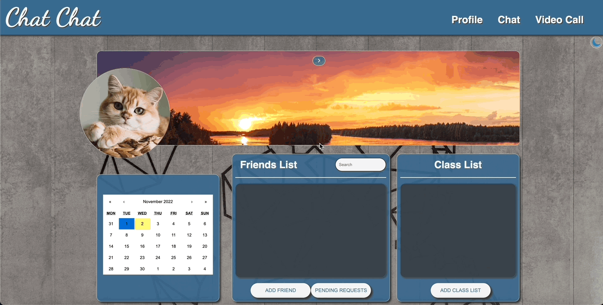
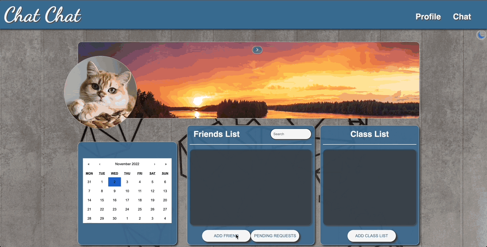

<div id="top"/>

# Chat Chat
Chat Chat is an educational learning website that allows teachers and language learners to connect, schedule meetings and practice their skills with one another. This is the culmination of eight engineers working closely over the course of one week to complete an MVP based on client's request.


## Table of Contents
- [Tech Stack](#tech-stack)
- [Product Features](#product-features)
  - [Profile](#profile)
  - [Distinct user authentication](#distinct-user-authentication)
  - [Live search with smart filter](#live-search-with-smart-filter)
  - [MyBooks](#mybooks)
  - [Book detail page](#book-detail-page)
  - [Reading Stats](#reading-stats)
  - [MyClubs](#myclubs)
  - [Club detail page](#club-detail-page)
  - [Live Chat](#live-chat)
  - [Video Chat](#video-chat)
- [Getting Started](#getting-started)
  - [Installation](#installation)
- [Contributors](#contributors)


## Tech Stack


## Product Features

### Profile


### Distinct user authentication


### Live search with smart filter

> Users can perform sitewide search to connect with other users



### Class lists

> Teachers can quickly import a csv to create a classlist


### Meetings

> Teachers can schedule meetings to video chat with existing friends


### Live chat


### Live site translation


### Including live chat translation


### Club detail page

> Users can create an event and post messages


### Live Chat
> Users can chat with other club members


### Video Chat
> users can initiate a video call for club members to join


## Getting Started

### Installation

From the root directory, run the following commands in your terminal.

1. To install all dependencies

```
npm install
```

2. To start dev server: open http://localhost:3000 to view it in your browser

```
npm run dev
```

3. To build for production

```
npm run build
```

4. To locally preview production build
```
npm run preview
```

5. To connect to the server: use http://localhost:3030 to verify the server connection
```
npm run serve
```

6. To connect to socket for live chat
```
npm run socket
```

## Contributors

&nbsp;

<a href="https://github.com/MarianTLibrarian/BookFace/graphs/contributors">
  
</a>

&nbsp;

While all members worked as full stack engineers to develop features, we also had these additional roles:

|   |  |
| ------------- | ------------- |
| Product Managers  | [Haley Jung](https://github.com/haleyjung) &  [Addison Hernandez](https://github.com/addisonhernandez)  |
| App Architects  | [Hailee Lu](https://github.com/HuijunLu) & [Katy Feng](https://github.com/katyfsy) |
| UI Leads  |[Junpeng Chang](https://github.com/jp-chang) & [Joseph Sanfelippo](https://github.com/JosephSanfelippo) |


<p align="right">(<a href="#top">back to top</a>)</p>
